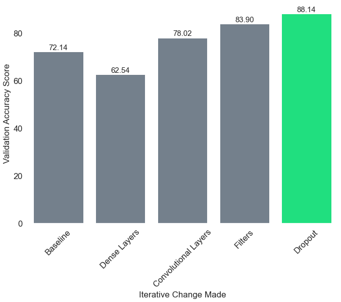

# Firearm Image Classification
`Author: Anita Camlic`
***

# Overview

According to Forbes' magazine, in the United States there have been 611 mass shootings so far this year (2022). As of Nov. 25 2022,  **39,935**  people have died from gun-related events in the U.S. this year, including **18,221** who died by homicide, murder or an unintentional shooting, plus another 21,714 who died by suicide.

Of those victims, **291 were children ages 0-11, and 1,225 were teens ages 12-17**. Gun violence is an epidemic. 

There is currently no systemic solution to gun violence in the United States. Though there has not been systemic changes to gun violence in the United States, there have been technological advancements that can be applied to this problem. One of those improvements being Convolutional Neural Networks. Convolutional Neural Networks can be used to identify patterns in images. For example, Convolutional Neural Networks can be used to differentiate between a cat and a dog in an image. They are used in applications like facial recognition for the Iphone and image tagging on facebook. Technology like this can also be used on videos, for applications like self driving cars and object detection. 

For my project, I will be using Convolutional Neural Networks to classify images as either holding a gun or holding a common handheld object. My project is a binary classification model. Since a lot of handheld devices (phone, wallet, credit card) can be mistaken for a gun (and vice versa), I plan to train a model to be able to make that distinction. This type of modeling could eventually be applied to surveillance cameras on public areas like schools, grocery stores, movie theaters and more. Hopefully this problem can be broadened upon in the future to reduce the amount of gun-related deaths and injuries in the United States.

***
# Business Problem

Schools need assurance that their students will be kept safe while at school. Children should not have to worry about being a victim of gun violence while they are at school. School should not be a place of fear. It should be a place of nurturing, learning and growing. To combat this fear that many have, I have created an image classification model that will differentiate common handheld objects and guns. This will make it easier for a school to recognize a threat and react accordingly. 

It could even trigger some sort of alarm or at least a call to the police. This can be used as a first line of defense against mass shooters. However, this should not be the only sort of defense. This is simply a tool that can quickly and  efficiently classify a gun vs other handheld objects. The main point of this system is to save time, and to get help to the area sooner in hopes to mitigate any potential damage.

Note: Though this model is directed towards public school districts, it is not limited to schools. I would like to see it implemented in all public spaces like grocery stores, government buildings, banks, shopping malls, places of worship, and many more.

***

# Data Understanding 

The data I used for this project is from the University of Granada's Andalusian Research Institute in Data Science and Computational Intelligence. The data is open data and able to be downloaded at the link below. 

The dataset I used specifically for this project was dataset 2.3 Weapons and similar handled object detection. [Dataset found here](https://github.com/ari-dasci/OD-WeaponDetection/tree/master/Weapons%20and%20similar%20handled%20objects) This dataset contains over 5,000 images of various weapons (knives, guns) and common handheld objects (wallet, credit card, cellphone, dollar bills). 

I did not include the data in the github because it was too large to fit. Below is the link to all of the datasets from the weapon detection project at the University of Granada's Andalusian Research Institute in Data Science and Computational Intelligence.

[All Weapon Detection Data](https://dasci.es/transferencia/open-data/24705/)

***

# Methods

Convolutional Neural Networks were used to try and create the best classifier for these images. Many hyperparameters were tweaked and different architectures were tried. See more in Final_Notebook.

# Visuals 

Here are the modeling changes that improved my validation score the most.

Here are the graphs of the loss and accuracy for training and validation data for my final model.

# Conclusion
### Conclusions and Recommendations
We conclude with an accuracy score of `0.7078189253807068` and a loss of `1.718071460723877`. Unfortunately, these models did not work as well as I would have wished on unseen data. However, I do believe that with more time I will be able to bring that accuracy score up. It is truly important that the accuracy score is as high as it can be for what it's intended use is.  

The final recommendations are to use this model as a tool for surveillance on the entrances and parking lot of public schools. This model has the power to classify images as either containing a weapon or not. This ability is so important to keeping children and teachers safe.  

### Limitations

Some limitations I ran into for this project were data, computational power and lack of time.

<u>**Data Limitations**</u>
For my data, I think there is a lack of cohesiveness which is confusing my model. In my data I have a mixture of images of strictly hands holding common handheld objects/firearms. However, I also have images of greater / larger scenes where there are full people holding the object of interest. I think my model is getting stuck and confused on the various types of images it is being trained on, because if you look at them side by side they are very different, and generalizing to two different types of images with different backgrounds, and multiple subjects is a difficult task in itself.

I think that for this starting project, I probably should have strictly stuck to JUST images of people's hands holding various objects. Then, for a larger project I could break out into larger scenes or even surveillance type screenshots. 

Ultimately, I want this model to be used on video surveillance, however, my model will not be able to generalize or even understand those types of images if that's not the type of data it is trained on. So for future projects, I want to collect surveillance camera data that is more aligned with my goal and that is cohesive in structure.

<u> **Computational Power Limitations** </u>
Since I am working from a laptop, my computational power is limited. Because of this, I didn't go as far with my computational exploration as I would have liked. If I had more computational power, I probably would have tried some larger Convolutional Neural Network Architectures. Since some of my images are on the larger end, I probably would have also increased the resolution in order for my model to potentially pick up more information in my data. 

<u> **Time Limitations** </u>
If I had more time, I would probably explore larger Convolutional Neural Network Architectures. Deeper (meaning more layers)  and wider (meaning more nodes per layer) Neural Networks have the ability to make better predictions, and learn more about its training data. However, it comes with a price. This would most likely lead to more overfitting than I already had, but the models would probably take an incredibly long time to run. That's time I simply do not have at the moment, but in the future I would like to play around with different architectures and image sizes

***
### Next Steps

For future projects I hope to expand upon this idea. I think this idea is really powerful, and can save lives.

<u> **Changing Data** </u>
For future exploration, I would like to try using different types of data. I would love to learn how to analyze video data to attempt to be able to detect a threat in real time.

I would also like to learn about how data affects these models. I would imagine they impact the model a lot, but what I want to explore is finding out how much variation in data can these Neural Networks take before the variety is too high to make meaningful conclusions / gain insight from the data. 

<u> **Expanding Model Capacity** </u>
In the future, I would love to expand upon my current neural network architectures. I would like to see the capacity of Convolutional Neural Networks on different types of images and different subjects of images as well.

<u> **Experiment with Object Detection and Multi-Class Classification** </u>
The last thing I am interested in pursuing in the future is Object Detection or having a model try to find and return the location in the image that the object is being found. That is a step above what I am currently working on.

Another area of interest would be multi class classification. So, for example, feeding a model images of all types of handheld objects and having it differentiate between the different objects. I think that would be a valuable area of study because it takes this problem a step further.

***
